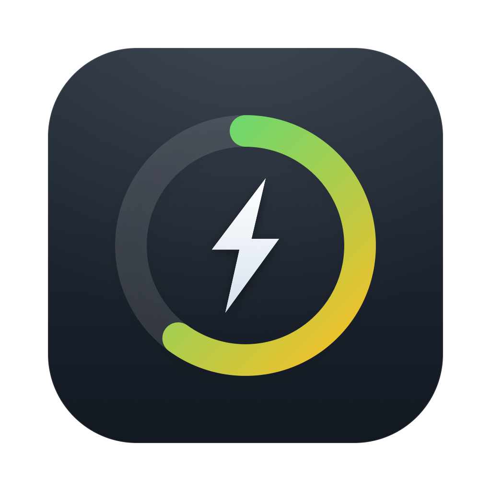
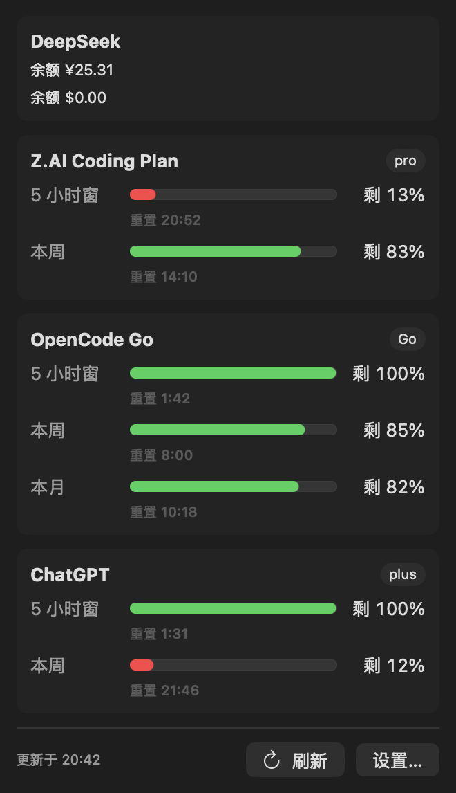
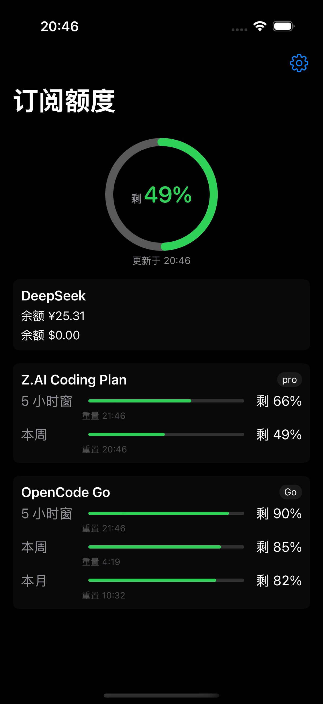
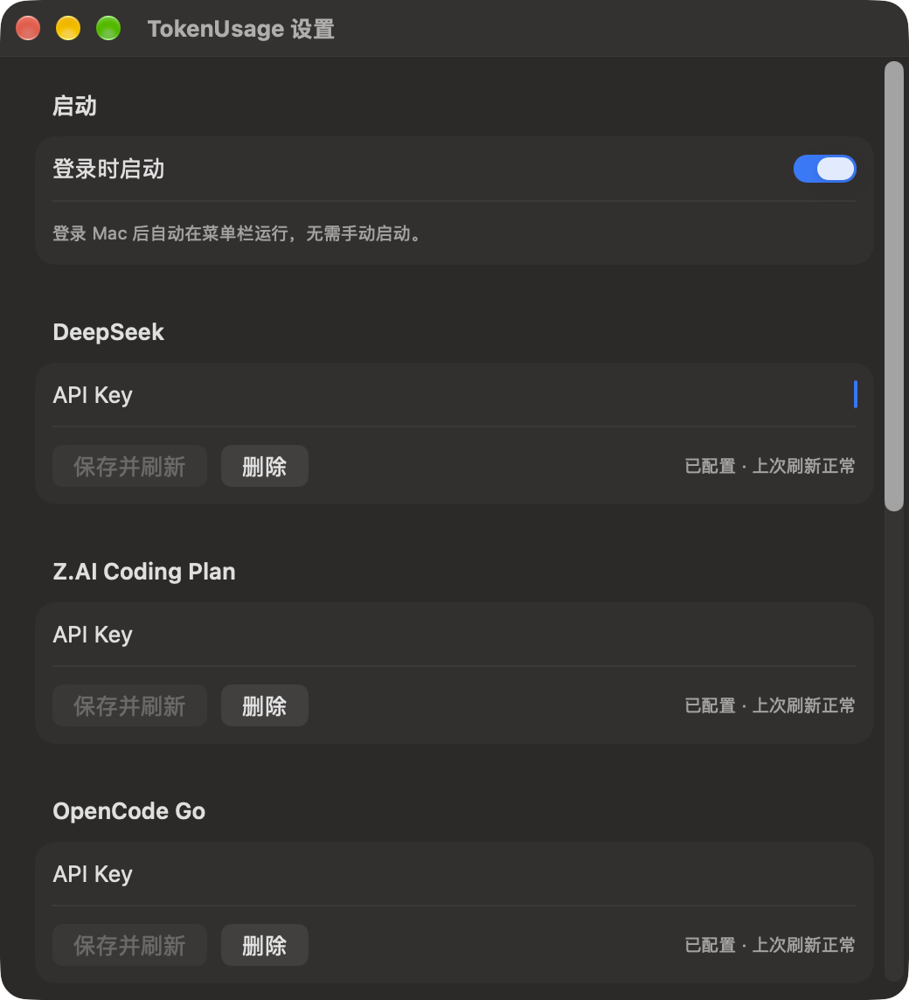

<div align="center">



# TokenUsage

**监测 token plan 订阅余额的 macOS 菜单栏 + iOS 应用**

SwiftUI · 纯本地 · 无遥测 · API key 只存 Keychain

</div>

---

## 界面预览

<table>
<tr>
<td align="center"><b>macOS 菜单栏面板</b></td>
<td align="center" rowspan="2"><b>iOS 主界面</b></td>
</tr>
<tr>
<td></td>
<td rowspan="1"></td>
</tr>
</table>



> 菜单栏图标：环长 = 剩余额度（越绿越健康），圆心为剩余百分比；面板与设置窗口如上。
> 截图由内置参数自动生成：`--demo-data`（演示数据）、`--show-panel` / `--shot=<name>:<path>`（离屏渲染导出）。

---

## 功能

- **macOS 菜单栏常驻**：环形图标实时显示订阅额度（弧长 = 剩余额度，越绿越健康，圆心显示剩余百分比），点击弹出详情面板
- **iOS App + 桌面小组件**：主界面总览 + 电池风格的 Medium 小组件（每家订阅一个圆环并排）
- **四家数据源**：

| 数据源 | 展示内容 | 平台 |
|---|---|---|
| [DeepSeek](https://platform.deepseek.com) | 多币种余额（¥/$） | 双端 |
| [Z.AI Coding Plan](https://z.ai)（GLM） | 5 小时窗 + 每周窗用量 | 双端 |
| [OpenCode Go](https://opencode.ai/go) | 滚动 / 周 / 月窗用量 | 双端 |
| ChatGPT（Plus/Pro） | 5 小时窗 + 周窗用量（读 Codex CLI OAuth） | 仅 macOS |
- **凭据互通**：iCloud 钥匙串自动同步（Mac 存 key → iPhone 免配置），QR 码离线导入兜底
- **菜单栏图标可配置**：显示哪一家订阅 × 哪个维度（5 小时 / 每周 / 每月 / 余额 / 最紧）
- **登录时启动**：设置页一键开关 macOS 登录项（`SMAppService`），开机自动驻留菜单栏

## 环境要求

| 依赖 | 版本 | 用途 |
|---|---|---|
| macOS + Xcode | 15+ / 16+ | 构建 |
| [XcodeGen](https://github.com/yonaskolb/XcodeGen) | 任意近期版本 | iOS 工程生成（`brew install xcodegen`） |
| Apple 开发者账号 | 付费（可选） | 真机部署、iCloud 钥匙串同步；仅模拟器可不需要 |

## 部署手册

### 1. 克隆并生成 iOS 工程

```bash
git clone https://github.com/<你的用户名>/TokenUsage.git
cd TokenUsage
xcodegen generate          # 生成 TokenUsage.xcodeproj（已在 .gitignore）
```

### 2. macOS 版

```bash
# 开发运行（ad-hoc 签名，本机即可）
./Scripts/run-dev.sh

# 如需固定签名（避免每次构建后 Keychain 重新弹授权）：
export TOKENUSAGE_SIGN_IDENTITY="Apple Development: 你的名字 (XXXXXXXXXX)"
./Scripts/run-dev.sh

# 正式安装到 /Applications（走 Xcode 自动签名，需要付费账号 + 设备已在 portal 注册）
export DEVELOPMENT_TEAM=你的TeamID
./Scripts/package.sh
open /Applications/TokenUsage.app
```

### 3. iOS 版

```bash
# 模拟器构建 / 运行（无需开发者账号）
./Scripts/build-ios.sh
./Scripts/run-ios-sim.sh

# 真机：Xcode 打开 TokenUsage.xcodeproj → 选 TokenUsageiOS scheme →
# Signing 里选你的 Team（或终端 export DEVELOPMENT_TEAM=xxx 后 xcodebuild）→ ⌘R
```

### 4. 配置数据源

1. 从各平台获取 API key：[DeepSeek](https://platform.deepseek.com/api_keys) / [Z.AI](https://z.ai/manage-apikey/apikey) / [OpenCode Go](https://opencode.ai/auth)
2. App 设置里粘贴（只存 Keychain，不落盘不进日志）
3. ChatGPT：Mac 上用 [Codex CLI](https://developers.openai.com/codex/cli/) 登录一次即可自动读取

### 5. 凭据互通（Mac → iPhone）

- **自动**：两端登录同一 Apple ID 并开启 iCloud 钥匙串，key 自动同步
- **手动**：Mac 设置「导出到 iOS（二维码）」→ iPhone 设置「从 Mac 导入」扫码

### 6. 小组件

iOS 主屏幕长按 → ➕ → 搜索 TokenUsage：Small（单环）/ Medium（电池风格多环，圆环窗口可在 App 设置里切换 5 小时 / 每周 / 每月）

## 隐私与安全

- API key 仅存 macOS/iOS Keychain（`kSecAttrAccessibleAfterFirstUnlock`），不写 UserDefaults / 文件 / 日志
- 小组件只读 App Group 快照，不联网、不触碰凭据
- 无任何遥测 / 分析 / 上报，全部请求直连各服务商官方端点（HTTPS）
- QR 导出包含明文 key，仅用于自有设备间传输，用完即关

## 常见问题

| 症状 | 原因与解法 |
|---|---|
| 每次运行弹 Keychain 授权 | ad-hoc 签名每次变化；设置 `TOKENUSAGE_SIGN_IDENTITY` 固定签名 |
| Mac 版安装后启动即闪退（exit 137） | 构建带了 keychain entitlement 但无匹配 profile；用 `package.sh`（自动签名）而非手工签名 |
| iCloud 钥匙串不生效 | 需 Xcode 自动签名（付费账号 + 设备注册），详见 [AGENTS.md](AGENTS.md) 的签名坑记录 |
| Z.AI 接口 404 | 额度端点是 `api.z.ai/api/monitor/...`，不是 `/api/coding/paas/...`，详见 AGENTS.md |

> `AGENTS.md` 记录了全部端点契约与 macOS 26 签名深坑（AMFI / -34018 / 通配 profile），二次开发前建议通读。

## 二次开发

```bash
swift build && swift test      # macOS SPM 构建 + 解码测试
./Scripts/make-icon.swift 脚本  # swift Scripts/make-icon.swift 重新生成应用图标
```

工程结构：`Sources/TokenUsage` 为双端共享代码（macOS 是 SPM executable，iOS 按 include/exclude 复用同一批文件，无独立 Core 模块），`Sources/TokenUsageiOS` / `Sources/TokenUsageWidget` 为 iOS 侧，`project.yml` 为 iOS 工程唯一事实源。

## 许可证

[MIT](LICENSE)
